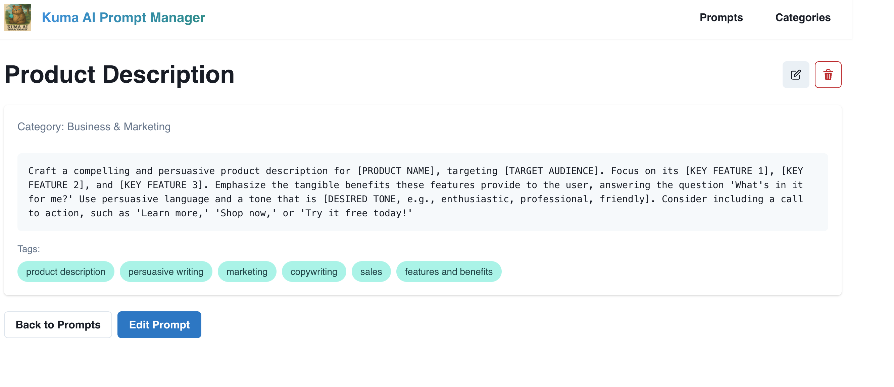

# Kuma AI Prompt Manager

A web application for managing and organizing AI prompts with categories and tags. This application allows users to create, read, update, and delete prompts, organize them into categories, and tag them for easy searching and filtering.

## Features

- **Prompt Management**: Create, read, update, and delete prompts
- **Categorization**: Organize prompts into categories
- **Tagging**: Add tags to prompts for better organization
- **Search**: Full-text search across prompts
- **Duplicate Detection**: Automatically detects similar prompts to prevent duplicates
- **Like System**: Like your favorite prompts and track them across sessions
- **Category Filtering**: Easily filter prompts by clicking on category names
- **Tag Filtering**: Filter prompts by tags with a single click
- **RESTful API**: Built with FastAPI for the backend
- **Modern Frontend**: Built with React and TypeScript
- **De-duplication**: Prevents duplicate prompts
- **Responsive Design**: Works on desktop and mobile devices

## Example UI

### Dashboard View


The dashboard provides an overview of all your prompts, organized by categories. Quickly access your most used prompts and see recent activity.

### Create/Edit Prompt


Easily create new prompts or edit existing ones with the intuitive form. Add tags, select categories, and format your content with markdown.

### Prompt Detail View


View all details of a prompt including its content, category, tags, and usage statistics. Copy the prompt with a single click or edit it as needed.

## UI Components

### Navigation
- Responsive sidebar for easy navigation between categories and tags
- Breadcrumb navigation for deep linking
- Quick access to search and create new prompts

### Prompt Cards
- Clean, card-based layout for easy scanning
- Color-coded categories for visual organization
- Like/unlike prompts with persistent state
- Quick actions (copy, edit, delete) on hover
- Clickable categories and tags for filtering

### Forms
- Intuitive form validation
- Markdown preview for prompt content
- Tag input with autocomplete
- Category selection dropdown

## Tech Stack

### Backend
- Python 3.8+
- FastAPI
- SQLAlchemy (ORM)
- SQLite (development) / PostgreSQL (production)
- Pydantic (data validation)
- TheFuzz (duplicate detection)

### Frontend
- React 18
- TypeScript
- Chakra UI
- React Query
- React Router
- Axios for API calls

## Getting Started

### Prerequisites

- Python 3.8+
- Node.js 16+ (for frontend)
- pip (Python package manager)
- npm or yarn (for frontend)

### Backend Setup

1. Clone the repository:
   ```bash
   git clone https://github.com/your-username/ai-prompt-manager.git
   cd ai-prompt-manager/backend
   ```

2. Create and activate a virtual environment:
   ```bash
   python -m venv venv
   source venv/bin/activate  # On Windows: venv\Scripts\activate
   ```

3. Install dependencies:
   ```bash
   pip install -r requirements.txt
   ```

4. Set up environment variables:
   ```bash
   cp .env.example .env
   # Edit .env file if needed
   ```

5. Initialize the database:
   ```bash
   python init_db.py
   ```

6. Start the development server:
   ```bash
   uvicorn main:app --reload
   ```

The backend API will be available at `http://localhost:8000`

### Frontend Setup

1. Navigate to the frontend directory:
   ```bash
   cd frontend
   ```

2. Install dependencies:
   ```bash
   npm install
   # or
   yarn install
   ```

3. Set up environment variables:
   ```bash
   cp .env.example .env
   # Edit .env file if needed
   ```

4. Start the development server:
   ```bash
   npm start
   # or
   yarn start
   ```

The frontend will be available at `http://localhost:3000`

## API Documentation

Once the backend server is running, you can access:

- Interactive API docs: http://localhost:8000/api/docs
- Alternative API docs: http://localhost:8000/api/redoc

## Project Structure

```
ai-prompt-manager/
├── backend/               # Backend API server
│   ├── app/              # Application code
│   │   ├── api/          # API endpoints
│   │   ├── core/         # Core functionality
│   │   ├── models/       # Database models
│   │   └── schemas/      # Pydantic models
│   ├── tests/            # Backend tests
│   ├── .env              # Environment variables
│   ├── main.py           # FastAPI application
│   └── requirements.txt  # Python dependencies
└── frontend/             # Frontend React app (coming soon)
    ├── public/          # Static files
    └── src/              # React components
```

## Running Tests

### Backend Tests

```bash
cd backend
pytest -v --cov=app --cov-report=term-missing
```

### Frontend Tests (coming soon)

```bash
cd frontend
npm test
```

## Deployment

### Backend

The backend can be deployed to any WSGI/ASGI server. Here's an example using Gunicorn with Uvicorn workers:

```bash
pip install gunicorn
cd backend
gunicorn -k uvicorn.workers.UvicornWorker -w 4 -b :8000 main:app
```

For production, you should:
1. Set `DEBUG=False` in your environment variables
2. Use a production-ready database like PostgreSQL
3. Set up proper CORS settings
4. Configure HTTPS
5. Set up proper logging and monitoring

## Contributing

1. Fork the repository
2. Create your feature branch (`git checkout -b feature/AmazingFeature`)
3. Commit your changes (`git commit -m 'Add some AmazingFeature'`)
4. Push to the branch (`git push origin feature/AmazingFeature`)
5. Open a Pull Request

## License

This project is licensed under the MIT License - see the [LICENSE](LICENSE) file for details.

## Acknowledgments

- [FastAPI](https://fastapi.tiangolo.com/) - The web framework used
- [SQLAlchemy](https://www.sqlalchemy.org/) - The ORM used
- [React](https://reactjs.org/) - The frontend library (coming soon)
- [Material-UI](https://material-ui.com/) - The UI component library (coming soon)
